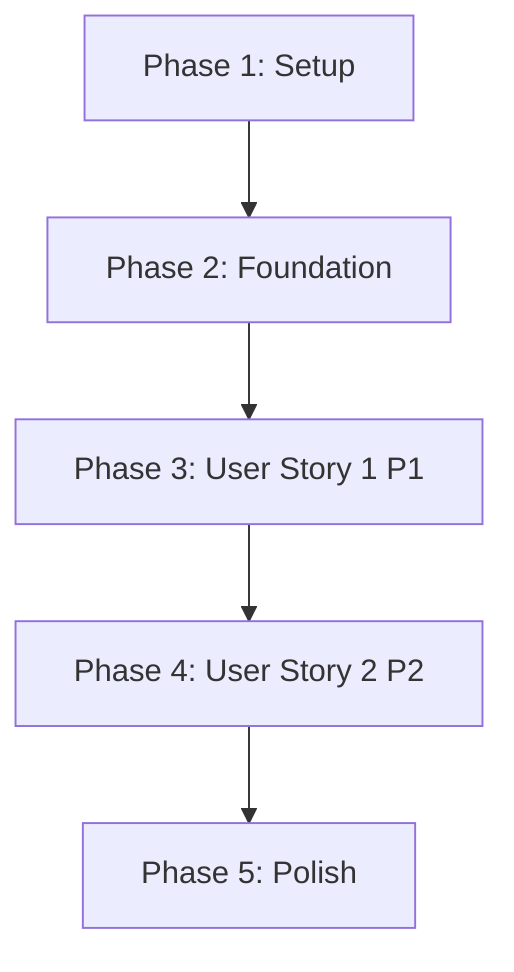

# Implementation Tasks: Email Partnership Contacts via Mailing Integration

**Feature**: 014-email-partnerships  
**Branch**: `014-email-partnerships`  
**Generated**: 2025-12-20  
**Total Tasks**: 17

---

## Implementation Strategy

**MVP Scope**: User Story 1 (P1) - Send Bulk Email to Filtered Partnerships
- Provides immediate value: organizers can send bulk emails to filtered partnerships
- Independently testable without P2 error handling enhancements
- Delivers core functionality needed by users

**Incremental Delivery**:
1. **Phase 1-2**: Setup and foundational infrastructure (blocking prerequisites)
2. **Phase 3**: User Story 1 (P1) - Core email sending functionality ⭐ MVP
3. **Phase 4**: User Story 2 (P2) - Enhanced error handling and edge cases
4. **Phase 5**: Polish and cross-cutting concerns

**Parallel Execution**: Tasks marked with [P] can be executed in parallel within their phase.

---

## Phase 1: Setup & Configuration

**Goal**: Initialize project structure and necessary JSON schemas for the new email endpoint.

**Prerequisites**: None (blocking tasks for all user stories)

### Tasks

- [ ] T001 [P] Create JSON schema for email request validation at `server/application/src/main/resources/schemas/send_partnership_email_request.schema.json`
- [ ] T002 [P] Create JSON schema for email response validation at `server/application/src/main/resources/schemas/send_partnership_email_response.schema.json`
- [ ] T003 [P] Add mock factory helper `insertMockedPartnershipEmail()` in `server/application/src/test/kotlin/fr/devlille/partners/connect/partnership/factories/PartnershipFactory.kt`

---

## Phase 2: Foundational Components

**Goal**: Create domain objects, repository interfaces, and notification gateway enhancements that are shared across all user stories.

**Prerequisites**: Phase 1 complete

**Independent Test**: Not applicable (foundational code reused by later phases)

### Tasks

- [ ] T004 Create `EmailContact` data class in `server/application/src/main/kotlin/fr/devlille/partners/connect/notifications/domain/EmailContact.kt`
- [ ] T005 Create `PartnershipWithEmails` data class in `server/application/src/main/kotlin/fr/devlille/partners/connect/partnership/domain/PartnershipWithEmails.kt`
- [ ] T006 Create `PartnershipEmailRepository` interface in `server/application/src/main/kotlin/fr/devlille/partners/connect/partnership/domain/PartnershipEmailRepository.kt`
- [ ] T007 Create `SendPartnershipEmailRequest` data class in `server/application/src/main/kotlin/fr/devlille/partners/connect/partnership/domain/SendPartnershipEmailRequest.kt`
- [ ] T008 Create `SendPartnershipEmailResponse` data class in `server/application/src/main/kotlin/fr/devlille/partners/connect/partnership/domain/SendPartnershipEmailResponse.kt`
- [ ] T009 Enhance `NotificationGateway` interface with generic `send()` function in `server/application/src/main/kotlin/fr/devlille/partners/connect/notifications/domain/NotificationGateway.kt`
- [ ] T010 Enhance `NotificationRepository` interface with `sendMail()` function in `server/application/src/main/kotlin/fr/devlille/partners/connect/notifications/domain/NotificationRepository.kt`

---

## Phase 3: User Story 1 (P1) - Send Bulk Email to Filtered Partnerships ⭐ MVP

**Goal**: Enable organizers to send bulk emails to filtered partnership groups with email deduplication and organizer-based grouping.

**User Story**: Event organizers need to communicate important information to specific groups of partners (e.g., all validated partnerships, all paid partnerships, specific sponsorship pack holders). Instead of manually copying emails and using external tools, organizers should be able to compose and send emails directly through the platform using the same filtering capabilities available in the partnership listing view.

**Prerequisites**: Phase 2 complete

**Independent Test**: Authenticate as an organizer, apply partnership filters (e.g., `filter[validated]=true`), provide email subject and body, and verify that all matching partnerships receive the email via their registered contact emails. Delivers standalone value for basic bulk communication needs.

**Acceptance Criteria**:
1. Organizer with edit permissions can send email to filtered partnerships
2. Email subject is prefixed with `[{event_name}]`
3. Partnerships are grouped by organizer (separate batches with correct From/CC)
4. Email addresses are deduplicated within each organizer group
5. Returns success with recipient count when Mailjet accepts batch
6. Returns 404 when no partnerships match filters
7. Returns 404 when Mailjet integration not configured

### Tasks

#### Contract Tests (TDD Approach)

- [ ] T011 [P] [US1] Write contract test for request schema validation in `server/application/src/test/kotlin/fr/devlille/partners/connect/partnership/PartnershipEmailRoutesContractTest.kt`
- [ ] T012 [P] [US1] Write contract test for response schema validation in `server/application/src/test/kotlin/fr/devlille/partners/connect/partnership/PartnershipEmailRoutesContractTest.kt`

#### Repository Implementation

- [ ] T013 [US1] Implement `PartnershipEmailRepositoryExposed` with `getPartnershipsWithEmails()` in `server/application/src/main/kotlin/fr/devlille/partners/connect/partnership/application/PartnershipEmailRepositoryExposed.kt`

#### Notification Layer Implementation

- [ ] T014 [US1] Implement `NotificationRepository.sendMail()` adapter function in `server/application/src/main/kotlin/fr/devlille/partners/connect/notifications/application/NotificationRepositoryImpl.kt`

#### Route Implementation

- [ ] T015 [US1] Implement `PartnershipEmailRoutes` with POST `/email` endpoint including organizer grouping logic in `server/application/src/main/kotlin/fr/devlille/partners/connect/partnership/infrastructure/api/PartnershipEmailRoutes.kt`
- [ ] T016 [US1] Register `PartnershipEmailRoutes` in Ktor routing configuration in `server/application/src/main/kotlin/fr/devlille/partners/connect/App.kt`
- [ ] T017 [US1] Register `PartnershipEmailRepository` binding in Koin module in `server/application/src/main/kotlin/fr/devlille/partners/connect/partnership/infrastructure/bindings/PartnershipBindings.kt`

#### Integration Tests

- [ ] T018 [US1] Write integration test for email grouping by organizer in `server/application/src/test/kotlin/fr/devlille/partners/connect/partnership/PartnershipEmailIntegrationTest.kt`
- [ ] T019 [US1] Write integration test for email deduplication logic in `server/application/src/test/kotlin/fr/devlille/partners/connect/partnership/PartnershipEmailIntegrationTest.kt`
- [ ] T020 [US1] Write integration test for From/CC address logic (organizer vs event) in `server/application/src/test/kotlin/fr/devlille/partners/connect/partnership/PartnershipEmailIntegrationTest.kt`

---

## Phase 4: User Story 2 (P2) - Email Delivery Status and Error Handling

**Goal**: Enhance error handling for production reliability with clear feedback about delivery failures, invalid credentials, and API errors.

**User Story**: When sending bulk emails, organizers need clear feedback about delivery success or failures. The system should handle scenarios where the mailing service is unavailable, API credentials are invalid, or some recipients fail while others succeed.

**Prerequisites**: Phase 3 complete (User Story 1 implemented)

**Independent Test**: Simulate Mailjet API failures, invalid credentials, or network errors, and verify appropriate error messages are returned to the organizer. Delivers value by improving user confidence and troubleshooting capabilities.

**Acceptance Criteria**:
1. Clear error message when Mailjet API returns error
2. Authentication error when Mailjet credentials are invalid
3. Success with recipient count when Mailjet accepts batch
4. Guidance to use Mailjet dashboard for per-recipient delivery tracking

### Tasks

#### Integration Tests

- [ ] T021 [P] [US2] Write integration test for Mailjet API failure scenario in `server/application/src/test/kotlin/fr/devlille/partners/connect/partnership/PartnershipEmailIntegrationTest.kt`
- [ ] T022 [P] [US2] Write integration test for Mailjet not configured scenario in `server/application/src/test/kotlin/fr/devlille/partners/connect/partnership/PartnershipEmailIntegrationTest.kt`
- [ ] T023 [P] [US2] Write integration test for empty filter results in `server/application/src/test/kotlin/fr/devlille/partners/connect/partnership/PartnershipEmailIntegrationTest.kt`

---

## Phase 5: Polish & Cross-Cutting Concerns

**Goal**: Complete OpenAPI documentation, validate ktlint/detekt compliance, and ensure all quality gates pass.

**Prerequisites**: Phase 4 complete

### Tasks

- [ ] T024 [P] Update OpenAPI specification with new POST endpoint in `server/application/src/main/resources/openapi/openapi.yaml`
- [ ] T025 [P] Add KDoc documentation to all public interfaces and classes
- [ ] T026 Run `./gradlew ktlintCheck detekt` and fix any violations
- [ ] T027 Run `./gradlew test` and ensure all tests pass with 80%+ coverage
- [ ] T028 [P] Run `npm run validate` for OpenAPI schema validation in `server/` directory

---

## Dependencies & Execution Order

### Story-Level Dependencies

**Blocking Path**: Setup → Foundation → US1 (MVP)

**Optional Enhancements**: US2 can be deferred if MVP delivery is prioritized

### Parallel Execution Opportunities

**Phase 1** (all parallel):
- T001, T002, T003 can run simultaneously (different files)

**Phase 2** (blocking - must complete in order):
- T004-T010 create interdependent domain objects and interfaces

**Phase 3** (within story):
- T011-T012 contract tests can run in parallel (different test scenarios)
- T013-T014 repository/notification implementations are independent
- T018-T020 integration tests can run in parallel (different test scenarios)

**Phase 4** (all parallel):
- T021-T023 test different error scenarios independently

**Phase 5** (parallel except T026-T027):
- T024, T025, T028 can run simultaneously
- T026 must complete before T027

---

## Task Summary by Phase

| Phase | Task Count | Parallel Tasks | Duration Estimate |
|-------|------------|----------------|-------------------|
| Phase 1: Setup | 3 | 3 | 30 min |
| Phase 2: Foundation | 7 | 0 | 2 hours |
| Phase 3: US1 (MVP) | 10 | 6 | 4 hours |
| Phase 4: US2 | 3 | 3 | 1 hour |
| Phase 5: Polish | 5 | 3 | 1 hour |
| **Total** | **28** | **15** | **~8.5 hours** |

---

## Validation Checklist

Before considering this feature complete:

- [ ] All 28 tasks completed
- [ ] All contract tests pass (T011-T012)
- [ ] All integration tests pass (T018-T023)
- [ ] ktlint/detekt reports zero violations (T026)
- [ ] Test coverage ≥80% for new code (T027)
- [ ] OpenAPI validation passes (T028)
- [ ] Manual testing via quickstart scenarios successful
- [ ] Constitution compliance verified (no repository dependencies, authorization via plugin, exception handling via StatusPages)

---

## Notes

**TDD Approach**: Contract tests (T011-T012) are written BEFORE implementation to ensure API schema compliance from the start.

**Architecture Patterns**:
- PartnershipEmailRepository: Data fetching only (returns EmailContact objects)
- NotificationRepository: Adapter layer (converts EmailContact to generic Destination format)
- NotificationGateway: Generic interface (Mailjet implementation handles config lookup)
- Routes: Orchestrate 3 repositories (PartnershipEmail, Event, Notification)

**No New Tables**: Feature reuses existing `partnerships`, `company_emails`, `events`, and `users` tables.

**Deduplication**: Handled in route layer via `.distinct()` on EmailContact list per organizer group.

**Error Handling**: StatusPages plugin maps exceptions to HTTP status codes (no try-catch in routes).
